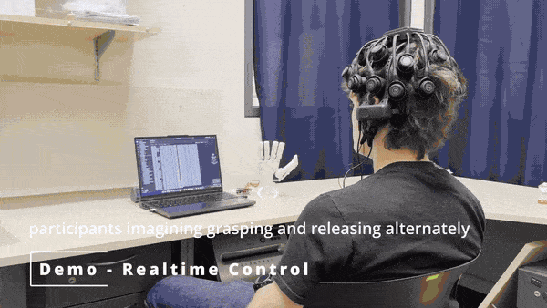

# EEG Motor-Imagery Controlled Robotic Hand

[](LICENSE)
[](https://www.python.org/)

> A real-time brain-computer interface that decodes **motor-imagery EEG**
> (grasp / hold / rest) from a 21-channel dry headset and drives a
> self-designed 3D-printed robotic hand. Independently designed and implemented.



## What it does

The user *imagines* grasping or releasing. An EEGNet classifier decodes the
intention from live EEG in real time, a majority-voting buffer smooths the
output, and the predicted command is streamed over serial to an Arduino that
actuates a 3D-printed hand — closing the full brain → hand loop.

## How it works

```
CGX Quick-20r v2 (21ch dry EEG)
        │   live stream
        ▼
  Preprocessing / band-pass filtering   (preprocessing.py)
        │
        ▼
  ASR artifact removal
        │
        ▼
  EEGNet classifier  →  GRASP / HOLD / REST   (model.py, best_model.pth)
        │   per-class probabilities
        ▼
  Majority-voting buffer (temporal smoothing)
        │
        ▼
  Serial command  →  Arduino  →  servos  →  3D-printed hand   (control.py)
```

## Tech stack

- **Signal / ML:** Python 3.14, PyTorch (EEGNet), MNE-Python, NumPy
- **EEG hardware:** CGX Quick-20r v2 — 21-channel dry-electrode headset
- **Actuation:** Arduino (serial control) + servos
- **Hand:** self-designed 3D-printed robotic hand

## Repository structure

| File | Purpose |
|------|---------|
| `acquisition.py` / `find_stream.py` | EEG stream acquisition |
| `collect_data.py` | Recording labeled motor-imagery trials |
| `preprocessing.py` | Filtering / artifact handling |
| `model.py` / `train_model.py` | EEGNet definition and training |
| `realtime_control.py` | Live decoding → serial → hand |
| `control.py` / `control_from_file.py` | Arduino serial command layer |
| `inspect_data.py` / `test_pipeline.py` | Data inspection & pipeline tests |
| `best_model.pth` / `scaler_params.npz` | Trained weights & normalization params |

## Quick start

```bash
pip install -r requirements.txt
```

```bash
# 1. Collect labeled motor-imagery data
python collect_data.py

# 2. Train the EEGNet model
python train_model.py

# 3. Run real-time control (EEG → hand)
python realtime_control.py
```

> Requires the CGX headset streaming over LSL and an Arduino connected via serial.

## Citation

If you reference this work, please cite it via the `CITATION.cff` file or the
project's Zenodo DOI (added on release).

## License

MIT — see [LICENSE](LICENSE).
